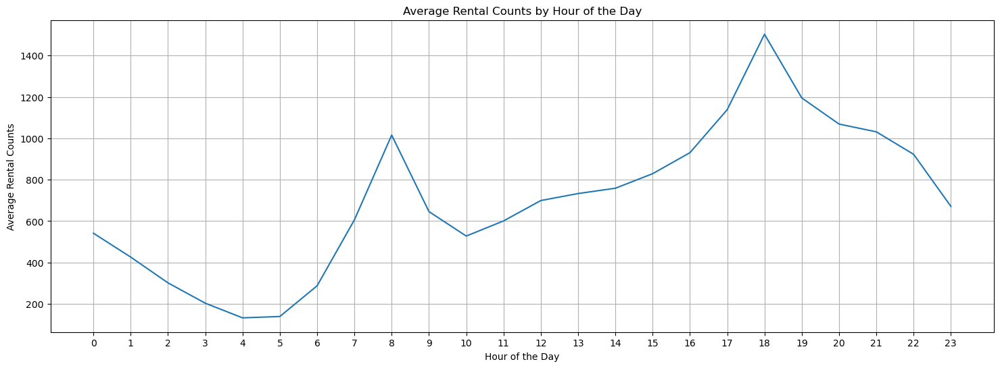
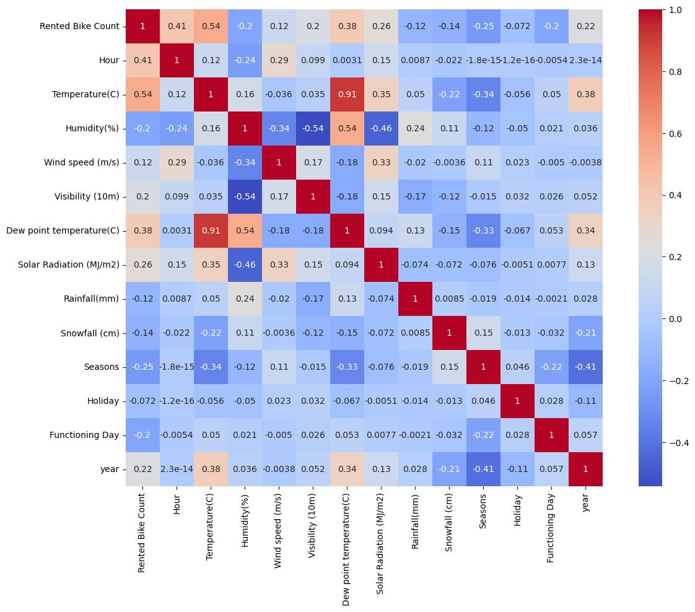
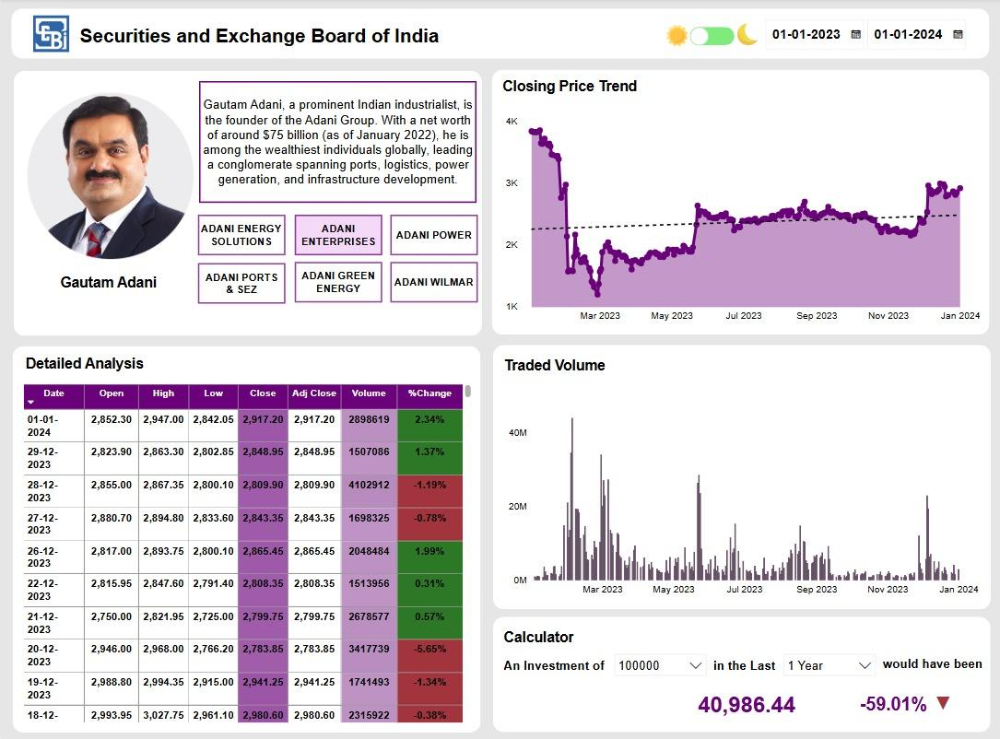
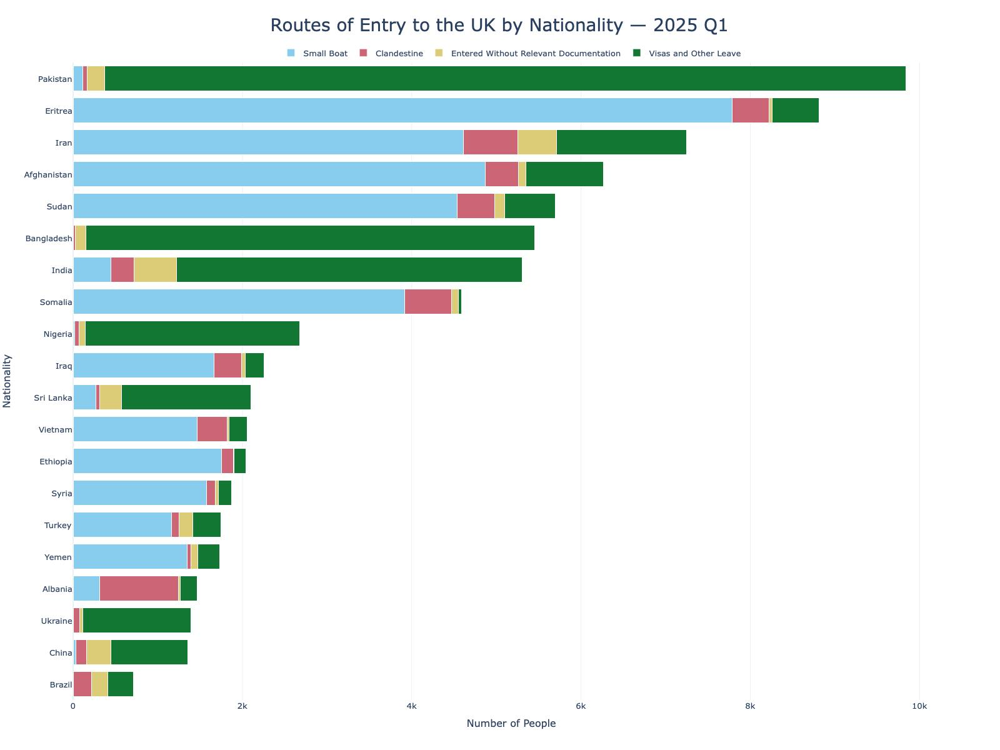
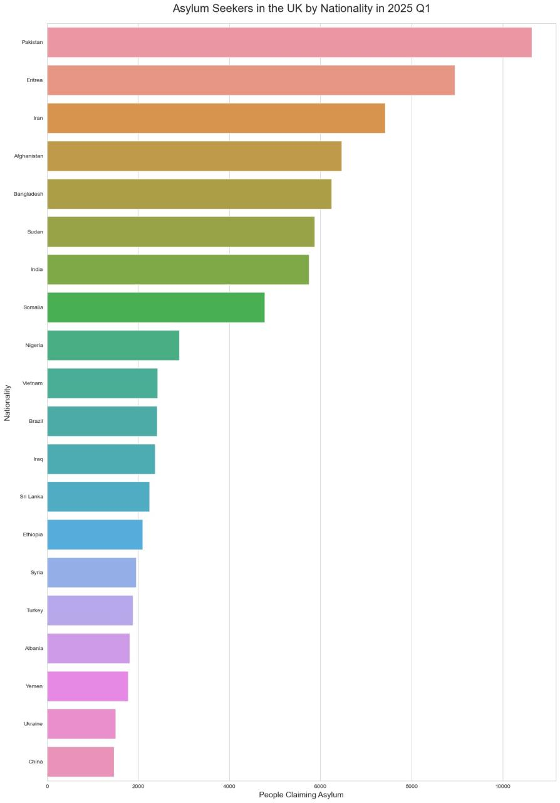
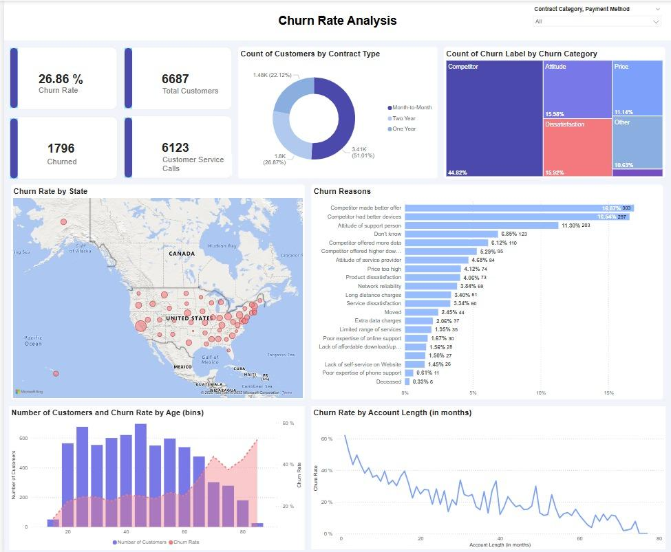

# 📊 Data Analytics Portfolio
Welcome to my Data Analysis Portfolio! This repository showcases my skills and experience in the field of data analysis
## 🛠️ Tech Stack

---

# 📑 Table of Contents

1. [Rental Bike Demand Prediction](#project-1--rental-bike-demand-prediction)
2. [Accenture Data Analytics & Visualization Simulation](#project-2--accenture-data-analytics--visualization-simulation)
3. [Adani Group Stock Market Dashboard](#project-3--adani-group-stock-market-dashboard)
4. [UK Asylum & Migration Analysis](#project-4--uk-asylum--migration-analysis)
5. [Industry Carbon Emissions Analysis](#project-5--industry-carbon-emissions-analysis)
6. [Customer Churn Analysis Dashboard](#project-6--customer-churn-analysis-dashboard)
7. [Spotify Songs Popularity Prediction](#project-7--spotify-songs-popularity-prediction)
8. [British Airways Review Analysis](#project-8--british-airways-review-analysis)
9. [Goodreads Book Recommendation System](#project-9--goodreads-book-recommendation-system)
10. [Buying Behaviour Prediction](#project-10--buying-behaviour-prediction)
11. [Wine Quality Prediction](#project-11--wine-quality-prediction)
12. [Per Country Analysis of DDoS Attacks](#project-12--per-country-analysis-of-ddos-attacks)
13. [Database Design & Implementation](#project-13--database-design--implementation)

---

# Project 1 : Rental Bike Demand Prediction

The objective of this project was to analyse historical bike rental data and develop machine learning models capable of accurately predicting future rental demand. The project involved data cleaning, feature engineering, exploratory data analysis, model training, and performance evaluation. By identifying the factors influencing rental demand, the project provides valuable insights that can support resource planning and operational decision-making for bike-sharing services.

## Average Rental Counts by Hour

  

## Correlation Heatmap

  

---

# Project 2 : Accenture Data Analytics & Visualization Simulation

This project was completed as part of the Accenture North America Data Analytics and Visualization Virtual Experience Program on Forage. It involved cleaning, modelling, and analysing multiple datasets to uncover trends in social media content. The findings were presented through a professional PowerPoint presentation, demonstrating the ability to transform complex datasets into actionable business insights for stakeholders.

---

# Project 3 : Adani Group Stock Market Dashboard

This interactive Power BI dashboard analyses the historical stock performance of major Adani Group companies over a one-year period. The dashboard includes investment simulations, stock price trends, trading volume analysis, and company performance metrics. It demonstrates advanced Power BI development, data modelling, DAX calculations, and business storytelling techniques.

  

---

# Project 4 : UK Asylum & Migration Analysis

This project explores UK asylum applications and migration trends using official datasets published by the UK Government. Python was used to clean, transform, and analyse the data, while Plotly was used to create interactive visualisations. The analysis highlights trends in asylum applications, nationalities, and routes of entry, showcasing strong exploratory data analysis and data visualisation skills.

  

  

---

# Project 5 : Industry Carbon Emissions Analysis

This SQL project focuses on analysing industry-wise carbon emissions using PostgreSQL. The objective was to identify the number of companies within each industry group and calculate their total product carbon footprint using only the latest available records. The project demonstrates SQL querying, aggregation, filtering, and analytical problem-solving techniques.

---

# Project 6 : Customer Churn Analysis Dashboard

This Power BI dashboard provides a comprehensive analysis of customer churn for a telecommunications company. It identifies churn trends across customer demographics, contract types, payment methods, geographic regions, and service quality. Interactive visualisations and KPI dashboards enable stakeholders to understand the primary reasons behind customer attrition and support data-driven retention strategies.

  

---

# Project 7 : Spotify Songs Popularity Prediction

This machine learning project predicts the popularity of Spotify songs using various audio features and track characteristics. Multiple predictive models were trained and evaluated to identify the factors most strongly influencing song popularity, providing valuable insights into music analytics and recommendation systems.

---

# Project 8 : British Airways Review Analysis

Completed as part of the British Airways Data Science Virtual Experience Program, this project involved web scraping customer reviews, performing sentiment analysis, and building predictive machine learning models to analyse customer satisfaction. The project demonstrates practical applications of natural language processing, data analysis, and predictive modelling.

---

# Project 9 : Goodreads Book Recommendation System

This project implements a recommendation engine capable of suggesting books based on user preferences and historical ratings. Machine learning algorithms were applied to recommend similar books, demonstrating recommendation system development and collaborative filtering concepts.

---

# Project 10 : Buying Behaviour Prediction

The objective of this project was to develop predictive machine learning models capable of identifying the factors influencing customer purchasing behaviour. Feature engineering, feature importance analysis, and predictive modelling techniques were applied to generate actionable insights that can support marketing and customer targeting strategies.

---

# Project 11 : Wine Quality Prediction

This project uses machine learning algorithms to predict wine quality based on various chemical properties. Multiple classification models were trained and compared to identify the most accurate approach while analysing the importance of individual features influencing wine quality.

---

# Project 12 : Per Country Analysis of DDoS Attacks

Conducted as part of my postgraduate studies, this project analysed global Distributed Denial of Service (DDoS) attack patterns across different countries. The analysis explored attack origins, frequency, and geographical trends, providing valuable cybersecurity insights through data visualisation and statistical analysis.

---

# Project 13 : Database Design & Implementation

This academic project involved designing and implementing a relational database management system for a university department. The work included relational database design, SQL implementation, XML database development, and ontology modelling, demonstrating a strong understanding of database architecture and management principles.

## 📬 Contact Information

Thank you for taking the time to explore my Data Analytics Portfolio. I hope these projects demonstrate my technical skills, analytical thinking, and ability to solve real-world business problems using data.

I'm always open to discussing Data Analytics, Business Intelligence, new opportunities, or potential collaborations. Feel free to get in touch using the contact details below.

📧 **Email:** sachinhooda3097@gmail.com

💼 **LinkedIn:** https://www.linkedin.com/in/sachinhooda3003/

🐙 **GitHub:** https://github.com/sachinhooda3097

---

## Author

**Sachin Hooda**
Data Analyst

SQL • Python • Power BI • Tableau • Excel

© 2026 Sachin Hooda. All rights reserved.
